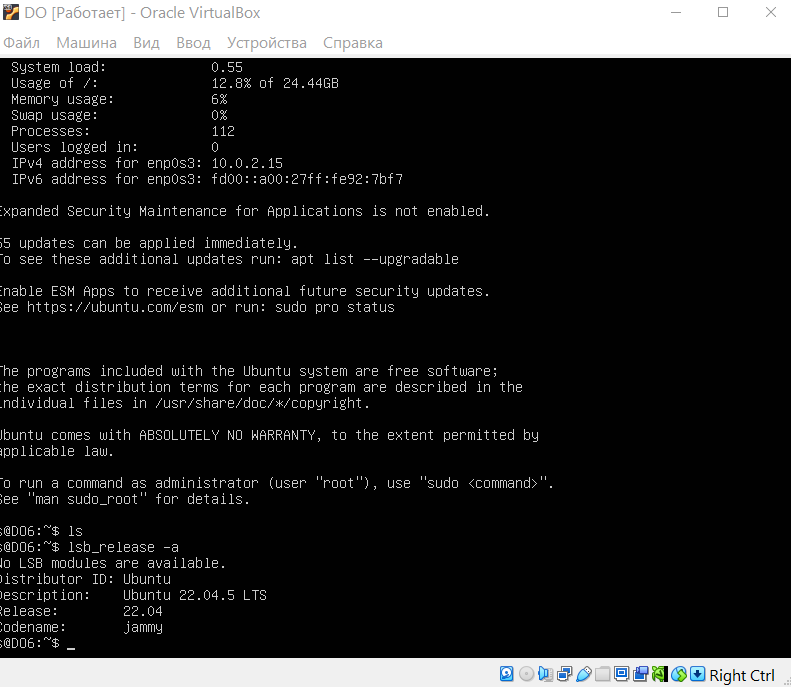

Основная часть

Подними виртуальную машину Ubuntu Server 22.04 LTS.

Настройка вашего gitlab-runner

- В репозитории пиров есть зарегистрированный gitlab-runner, что подтверждается запущенными и завершенными конвейерами в репозитории

- В репозитории пиров есть дамп виртуальной машины с зарегистрированным gitlab-runner